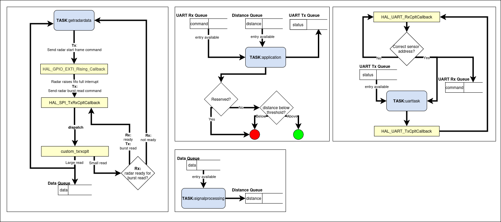
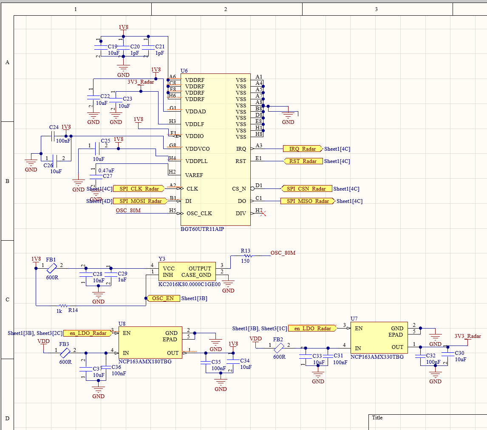
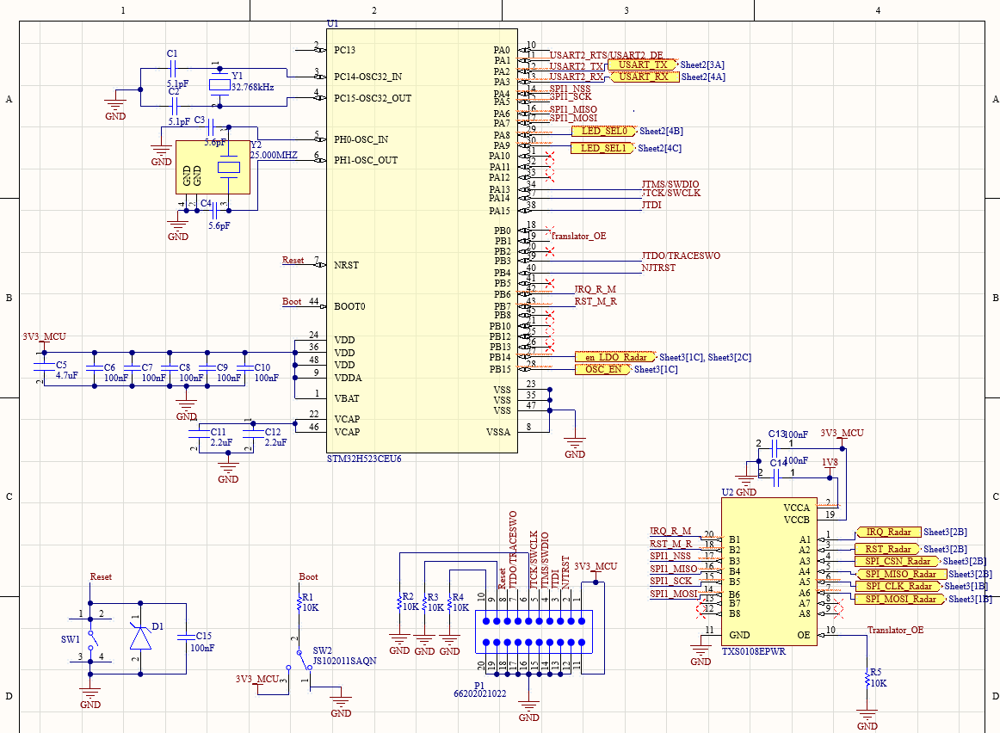
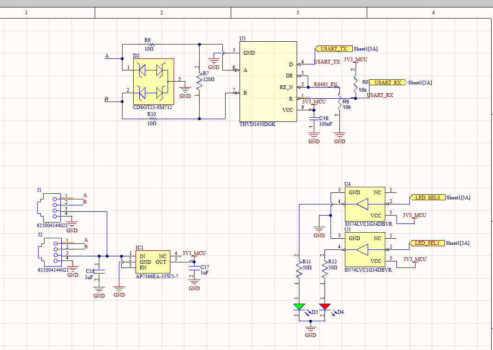
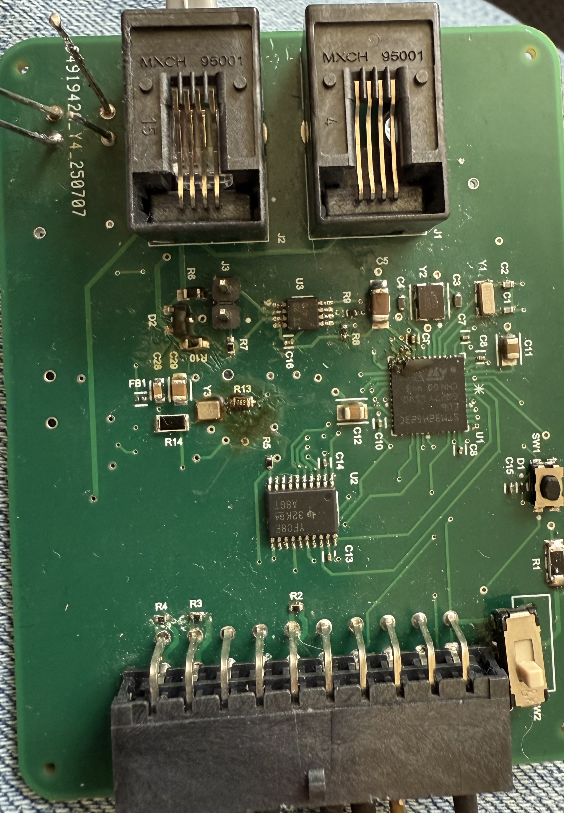

# BGT60UTR11AIP with STM32H523CEU6
>This project uses infineons bgt60utr11aip chip to detect the distance of a stationary object. Interfacing this sensor with the stm32h523ceu6 involved implementing the platform functions specific to the stm32 chip in xensiv_bgt60trxx_platform.c.

### Communication protocols
- SPI: spi is used to communicate with the bgt60utr11aip chip.
- UART: uart is used to communicate with an esp32 dev board.

### libraries
- ARM CMSIS DSP
- ARM CMSIS Free RTOS v2
- Platform functions from [infineon git repo](https://github.com/Infineon/sensor-xensiv-bgt60trxx)

### Program Structure

#### 1. Initialization
- **System Clock Setup**  
  - Configures PLL, HSE/LSE, and system frequencies.
- **Peripheral Initialization**  
  - SPI (for radar FIFO reads)  
  - GPIO (power enable, oscillator enable, translator OE, LEDs, IRQ lines)  
  - FreeRTOS (task creation, scheduler start)
  - UART (for sending radar data)

#### 2. FreeRTOS
- **Tasks**
  -  getradardata
  -  signalprocessing
  -  application
  -  uarttask
- **Queues**
  -  filledbuffers
  -  distancequeue
  -  uartcommands

#### 3. Callbacks
- HAL_SPI_TxRxCpltCallback
- HAL_GPIO_EXTI_Rising_Callback
- custom_txrxcplt
- HAL_UART_ErrorCallback
- HAL_UART_TxCpltCallback
- HAL_UART_RxCpltCallback

##### getradardata Task
- Allocates buffer from memory pool
- Waits for **custom_txrxcplt** to notify.
- Calls `xensiv_bgt60trxx_get_fifo_data()` to fetch samples (1024 samples per buffer)
- Uses **SPI burst reads** to read (num of 12bit samples / 2) * 3 bytes from the radar
- DMA mode for continuous FIFO reads from radar, send buffer to **filledbuffers** queue

##### signalprocessing Task
- Waits for message from **filledbuffers** queue
- Reconstructs samples
- Removes DC bias
- Applies **window function**
- Runs **FFT (CMSIS-DSP RFFT)**:
  - Input: 1024 ADC samples  
  - Output: 512 magnitude bins
- Post-processing:
  - Remove DC bias  
  - Drop low bins (1–10) to suppress noise  
  - Detect peaks, compute peak **range bin** (map FFT index → distance)
- average 10 distance values and place the average in the **distancequeue**

##### application Task
- Get averaged distance value from **distancequeue** 
- Get uart msg from **uartcommands** queue
- Toggle LEDs based on the distance threshold (default 1.5 meters) & uart command 

##### uarttask Task
- Wait for UART message received.
- Reactivate UART DMA transmit after delay.

##### 4. Program Flow
1. **Boot → System Init, Radar init**  
2. **FreeRTOS Init → initalize arrays, start scheduler**  
4. **getradardata Task reads samples**  
5. **signalprocessing Task computes FFT**  
6. **application Task interprets distances, commands received from UART**  
7. **uarttask Task waits for uart msg and reactivates dma transfer**
7. **Loop indefinitely**

